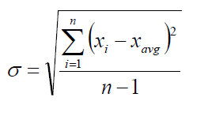

## Autor: Daniel Felipe Alfonso Bueno 
## Profesor: Luis Daniel Benavides 
## AREP - Arquitectura Empresarial
# Calculator 
En este proyecto, podremos realizar dos operaciones muy importantes para el análisis de datos, 
como lo son el cálculo de la media y la desviación estándar de estos datos. Recibiremos un archivo 
de n Números reales línea a línea. Guardaremos estos datos en nuestra propia implementación de 
lista enlazada y procederemos a calcular. Primero realizaremos la media y después la
desviación ya que esta depende del valor de la media para realizar la sumatoria.  
## Prerrequisitos 
Se debe tener instalado JAVA JDK 8 o superior y MVN.
### Calculo de la media. 
Realizamos una sumatoria de todos los datos que tenemos y lo dividimos entre el número 
total de datos como observamos en la siguiente formula 

### Calculo de la desviación estándar 

Realizamos la sumatoria de la resta de cada valor menos el resultado que obtuvimos de la media, dividido
el número total de datos menos uno y a todo este resultado sacamos raíz cuadrada como se muestra. 

### Implementación lista enlazada (LinkedList)

Es una estructura lineal que almacena una colección de elementos generalmente
son nodos en donde cada uno almacena datos y una referencia a otros nodos así cada uno 
puede encontrarse de manera sencilla en la memoria. Son una estructura de datos dinámica
se utiliza para almacenar datos que cambian constantemente ya que son muy flexibles porque 
se expanden o contraen según el almacenamiento de los datos. 
Las operaciones que implemente en esta lista fueran add y remove(por derecha) y método iterator
para recorrer de manera sencilla nuestra estructura de datos con un ciclo. Esto lo extendemos de la interfaz List 
para integrarlo al API de JAVA

## Diseño 
En el archivo AREP Design podremos encontrar la metafora de diseño seguida y la explicación del modelo de clases realizado

## Uso del proyecto 
Para ejecutar nuestro proyecto, procederemos a clonarlo del repositorio de GitHub
en el siguiente link https://github.com/DanielAlfonso17/AREP-LAB1.git desde la terminal de comandos
de la siguiente manera
~~~
git clone https://github.com/DanielAlfonso17/AREP-LAB1.git
~~~
Después nos movemos al directorio donde está ubicado nuestro proyecto y en consola 
ejecutamos mvn para compilar 
~~~
mvn package 
~~~

En el proyecto contamos con unos archivos de prueba, si desea incluir sus propios archivos
en esta carpeta podrá hacerlo con libertad. Aquí tendremos los archivos que procederemos a probar.
Para la ejecución de nuestro proyecto con el siguiente comando utilizando el JAR generando 
en la compilación previa.  
~~~
java -cp target\OODesign-1.0-SNAPSHOT.jar edu.escuelaing.OODesign.App ArchivosPrueba\archivo1
~~~
Como resultado de la ejecución podremos observar lo siguiente en consola 

Podemos genera la documentación del proyecto con el comando 
~~~
mvn javadoc:javadoc
~~~
Los archivos html de documentación se guardaran en el directorio target/site
## Ejecucion de pruebas 
Podemos ejecutar para la realización de las pruebas:  
~~~
mvn package ó mvn test
~~~
El resultado de las pruebas es exitoso como podemos ver. 

Se probaron los siguientes casos, que fueron pedidos se mostraran las tablas de los valores y sus 
respectivos resultados  y comparación con las pruebas realizadas 

##### Prueba 1 
Datos 

Resultado teórico:

 

Resultado obtenido: 

##### Prueba 2 
Datos 

Resultado Esperado:

Resultado Obtenido:

Como podemos observar, se lograron con éxito las pruebas establecidas. Podemos usar 
este programa, para probar distintos cálculos matemáticos además es extensible. Ya que 
para otras operaciones matemáticas o estadísticas, bastaría con crear las clases e implementar la 
interfaz Operations. 

